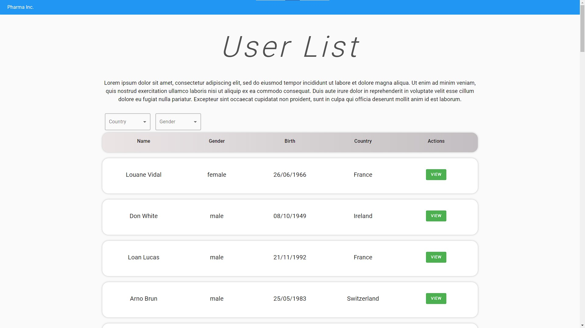
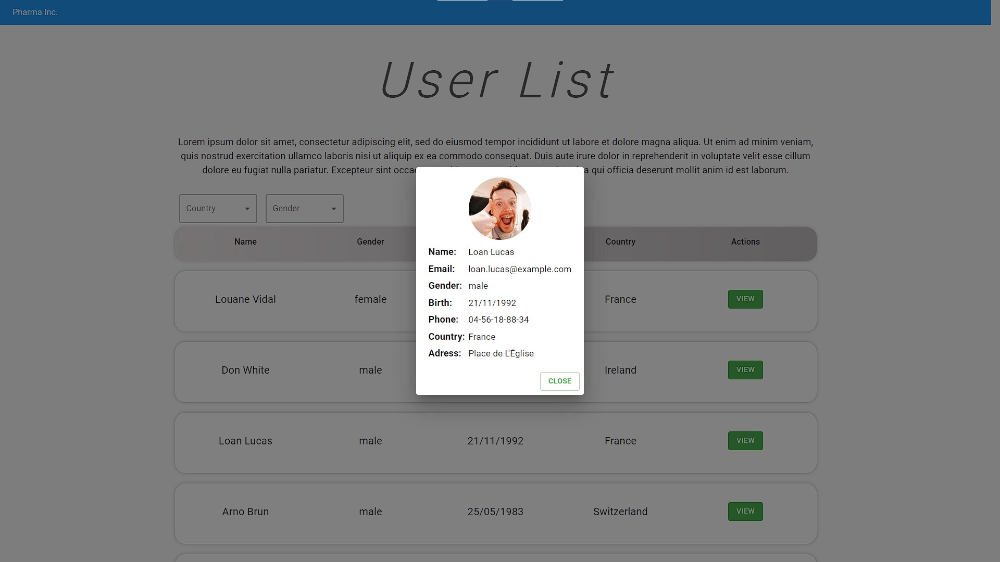

# Front-End Challenge 🏅 2021
## Case

A empresa Pharma Inc, está trabalhando em um projeto em colaboração com sua base de clientes para facilitar a gestão e visualização da informação dos seus pacientes de maneira simples e objetiva em um Dashboard onde podem listar, filtrar e expandir os dados disponíveis. O seu objetivo nesse projeto, é trabalhar no desenvolvimento do Front end que consumirá a API da empresa Pharma Inc seguindo os requisitos propostos neste desafio.

## Recursos

1.  Estudar a documentação da REST API: [https://randomuser.me/documentation](https://randomuser.me/documentation)
    
2.  Utilizar React.js ou Vue.js ou Angular 8+ para construir a solução do Challenge;
    
3.  Utilizar Frameworks CSS, recomendamos alguns como:
    
    -   Tailwind CSS: [https://tailwindcss.com/](https://tailwindcss.com/)
    -   Material UI: [https://material-ui.com/](https://material-ui.com/)
    -   Angular Material: [https://material.angular.io/](https://material.angular.io/)
    -   Bootstrap: [https://getbootstrap.com/](https://getbootstrap.com/)
    -   Bulma: [https://bulma.io/](https://bulma.io/)
4.  Trabalhar em um [FORK](https://lab.coodesh.com/help/gitlab-basics/fork-project.md) deste repositório em seu usuário ou utilizar um repositório em seu github pessoal (não esqueça de colocar no readme a referência a este challenge)

## Prévia

## Tecnologias Utilizadas 
- HTML
- CSS
- Javascript
- React
- Material-IU
- Axios

## Instalar
Instalar pacotes:
`npm install`

Iniciar aplicação:
`npm run start`